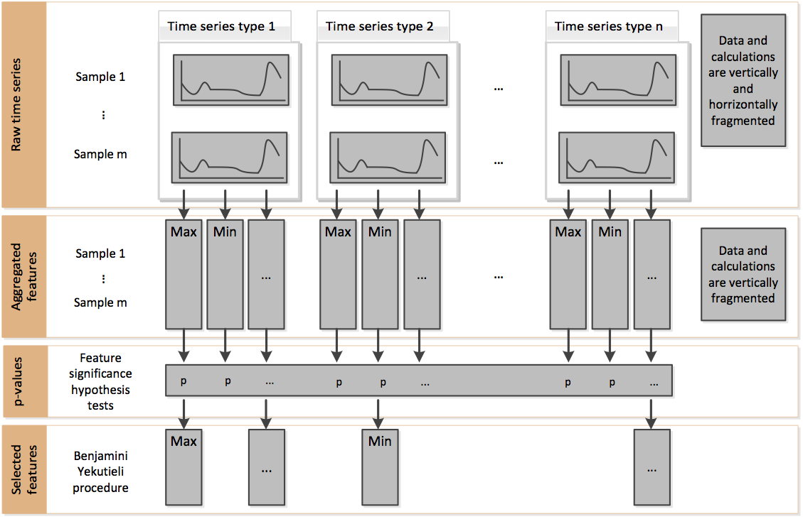

Feature filtering
=================

The all-relevant problem of feature selection is the identification of all strongly and weakly relevant attributes.
This problem is especially hard to solve for time series classification and regression in industrial applications such
as predictive maintenance or production line optimization, for which each label or regression target is associated with
several time series and meta-information simultaneously.

To limit the number of irrelevant features, tsfresh deploys the fresh algorithm (fresh stands for `FeatuRe Extraction
based on Scalable Hypothesis tests`) [1]_.

The algorithm is called by :func:`tsfresh.feature_selection.relevance.calculate_relevance_table`.
It is an efficient, scalable feature extraction algorithm, which filters the available features in an early stage of the
machine learning pipeline with respect to their significance for the classification or regression task, while
controlling the expected percentage of selected but irrelevant features.

The filtering process consists of three phases depicted in the following figure:

Phase 1 - Feature extraction
''''''''''''''''''''''''''''

Firstly, the algorithm characterizes time series with comprehensive and well-established feature mappings and considers
additional features describing meta-information.
The feature calculators used to derive the features are those in
:mod:`tsfresh.feature_extraction.feature_calculators`.

In the above figure, this corresponds to the change from raw time series to aggregated features.

Phase 2 - Feature significance testing
''''''''''''''''''''''''''''''''''''''

In a second step, each feature vector is individually and independently evaluated with respect to its significance for
predicting the target under investigation.
Those tests are located in the submodule :mod:`tsfresh.feature_selection.significance_tests`.
The result of these tests is a vector of p-values, quantifying the significance of each feature for predicting the
label/target.

In the above figure, this corresponds to the change from aggregated features to p-values.

Phase 3 - Multiple test procedure
'''''''''''''''''''''''''''''''''

The vector of p-values is evaluated on the basis of the Benjamini-Yekutieli procedure [2]_ in order to decide which features
to keep.
This multiple testing procedure is taken from the statsmodel package.

In the above figure, this corresponds to the change from p-values to selected features.

References
''''''''''

    .. [1] Christ, M., Kempa-Liehr, A.W. and Feindt, M. (2016).
         Distributed and parallel time series feature extraction for industrial big data applications.
         ArXiv e-prints: 1610.07717 URL: http://adsabs.harvard.edu/abs/2016arXiv161007717C

    .. [2] Benjamini, Y. and Yekutieli, D. (2001).
        The control of the false discovery rate in multiple testing under dependency.
        Annals of statistics, 1165--1188
