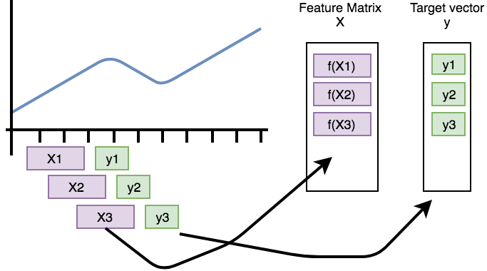

.. _forecasting-label:

Rolling/Time series forecasting
===============================

Features extracted with *tsfresh* can be used for many different tasks, such as time series classification,
compression or forecasting.
This section explains how we can use the features for time series forecasting.

Let's say you have the price of a certain stock, e.g., Apple, for 100 time steps.
Now, you want to build a feature-based model to forecast future prices of the Apple stock.
You could remove the last price value (of today) and extract features from the time series until today to predict the price of today.
But this would only give you a single example to train.
Instead, you can repeat this process: for every day in your stock price time series, remove the current value, extract features for the time until this value and train to predict the value of the day (which you removed).
You can think of it as shifting a cut-out window over your sorted time series data: on each shift step you extract the data you see through your cut-out window to build a new, smaller time series and extract features only on this one.
Then you continue shifting.
In ``tsfresh``, the process of shifting a cut-out window over your data to create smaller time series cut-outs is called *rolling*.

Rolling is a way to turn a single time series into multiple time series, each of them ending one (or n) time step later than the one before.
The rolling utilities implemented in `tsfresh` help you in this process of reshaping (and rolling) your data into a format on which you can apply the usual :func:`tsfresh.extract_features` method.
This means that the step of extracting the time series windows and the feature extraction are separated.

Please note that "time" does not necessarily mean clock time here.
The "sort" column of a DataFrame in the supported :ref:`data-formats-label` gives a sequential state to the
individual measurements.
In the case of time series this can be the *time* dimension while in other cases, this can be a location, a frequency. etc.

The following image illustrates the process:

.. image:: ../images/rolling_mechanism_1.png
   :scale: 100 %
   :alt: The rolling mechanism
   :align: center

Another example can be found in streaming data, e.g., in Industry 4.0 applications.
Here, you typically get one new data row at a time and use it to, for example, predict machine failures. To train your model,
you could act as if you would stream the data, by feeding your classifier the data after one time step,
the data after the first two time steps, etc.

In tsfresh, rolling is implemented via the helper function :func:`tsfresh.utilities.dataframe_functions.roll_time_series`.
Further, we provide the :func:`tsfresh.utilities.dataframe_functions.make_forecasting_frame` method as a convenient
wrapper to quickly construct the container and target vector for a given sequence.

Let's walk through an example to see how it works:

The rolling mechanism
---------------------

We look into the following flat DataFrame example, which is a tsfresh suitable format (see :ref:`data-formats-label`).
Note, that rolling also works for all other time series formats.

+----+------+----+----+
| id | time | x  | y  |
+====+======+====+====+
| 1  |  1   | 1  | 5  |
+----+------+----+----+
| 1  |  2   | 2  | 6  |
+----+------+----+----+
| 1  |  3   | 3  | 7  |
+----+------+----+----+
| 1  |  4   | 4  | 8  |
+----+------+----+----+
| 2  |  8   | 10 | 12 |
+----+------+----+----+
| 2  |  9   | 11 | 13 |
+----+------+----+----+

In the above flat DataFrame, we measured the values from two sensors x and y for two different entities (id 1 and 2) in 4 or 2 time
steps (1, 2, 3, 4, 8, 9).

If you want to follow along, here is the python code to generate this data:

.. code:: python

   import pandas as pd
   df = pd.DataFrame({
      "id": [1, 1, 1, 1, 2, 2],
      "time": [1, 2, 3, 4, 8, 9],
      "x": [1, 2, 3, 4, 10, 11],
      "y": [5, 6, 7, 8, 12, 13],
   })

Now, we can use :func:`tsfresh.utilities.dataframe_functions.roll_time_series` to get consecutive sub-time series.
You could think of having a window sliding over your time series data and extracting out every data you can see through this window.
There are three parameters to tune for the window:

* `max_timeshift` defines, how large the window is at maximum. The extracted time series will have at maximum length of `max_timeshift + 1`.
  (they can also be smaller, as time stamps in the beginning have less past values).
* `min_timeshift` defines the minimal size of each window. Shorter time series (usually at the beginning) will be omitted.
* Advanced: `rolling_direction`: if you want to slide in positive (increasing sort) or negative (decreasing sort) direction. You barely need negative direction, so you probably do not want to change the default. The absolute value of this parameter decides how much you want to shift per cut-out step.

The column parameters are the same as in the usual :ref:`data-formats-label`.

Let's see what will happen with our data sample:

.. code:: python

   from tsfresh.utilities.dataframe_functions import roll_time_series
   df_rolled = roll_time_series(df, column_id="id", column_sort="time")

The new data set consists only of values from the old data set, but with new ids.
Also the sort column values (in this case ``time``) is copied.
If you group by ``id``, you will end up with the following parts (or "windows"):

+-------+-------+---+----+
| id    | time  | x |  y |
+=======+=======+===+====+
| (1,1) |    1  | 1 |  5 |
+-------+-------+---+----+

+-------+-------+---+----+
| id    | time  | x |  y |
+=======+=======+===+====+
| (1,2) |    1  | 1 |  5 |
+-------+-------+---+----+
| (1,2) |    2  | 2 |  6 |
+-------+-------+---+----+

+-------+-------+---+----+
| id    | time  | x |  y |
+=======+=======+===+====+
| (1,3) |    1  | 1 |  5 |
+-------+-------+---+----+
| (1,3) |    2  | 2 |  6 |
+-------+-------+---+----+
| (1,3) |    3  | 3 |  7 |
+-------+-------+---+----+

+-------+-------+---+----+
| id    | time  | x |  y |
+=======+=======+===+====+
| (1,4) |    1  | 1 |  5 |
+-------+-------+---+----+
| (1,4) |    2  | 2 |  6 |
+-------+-------+---+----+
| (1,4) |    3  | 3 |  7 |
+-------+-------+---+----+
| (1,4) |    4  | 4 |  8 |
+-------+-------+---+----+

+-------+-------+---+----+
| id    | time  | x |  y |
+=======+=======+===+====+
| (2,8) |    8  |10 | 12 |
+-------+-------+---+----+

+-------+-------+---+----+
| id    | time  | x |  y |
+=======+=======+===+====+
| (2,9) |    8  |10 | 12 |
+-------+-------+---+----+
| (2,9) |    9  |11 | 13 |
+-------+-------+---+----+

Now, you can run the usual feature extraction procedure on the rolled data:

.. code:: python

   from tsfresh import extract_features
   df_features = extract_features(df_rolled, column_id="id", column_sort="time")

You will end up with features generated for each one of the parts above, which you can then use for training your forecasting model.

+----------+----------------+-----------------------------+-----+
| variable |  x__abs_energy |  x__absolute_sum_of_changes | ... |
+==========+================+=============================+=====+
| id       |                |                             | ... |
+----------+----------------+-----------------------------+-----+
| (1,1)    |            1.0 |                         0.0 | ... |
+----------+----------------+-----------------------------+-----+
| (1,2)    |            5.0 |                         1.0 | ... |
+----------+----------------+-----------------------------+-----+
| (1,3)    |           14.0 |                         2.0 | ... |
+----------+----------------+-----------------------------+-----+
| (1,4)    |           30.0 |                         3.0 | ... |
+----------+----------------+-----------------------------+-----+
| (2,8)    |          100.0 |                         0.0 | ... |
+----------+----------------+-----------------------------+-----+
| (2,9)    |          221.0 |                         1.0 | ... |
+----------+----------------+-----------------------------+-----+

The features for example for id ``(1,3)`` are extracted using the data of ``id=1`` up to and including ``t=3`` (so ``t=1``, ``t=2`` and ``t=3``).

If you want to train a model for a forecasting, `tsfresh` also offers the function :func:`tsfresh.utilities.dataframe_functions.make_forecasting_frame`, which will help you match the target vector properly.
This process is visualized in the following figure.
It shows how the purple, rolled sub-timeseries are used as base for the construction of the feature matrix *X*
(if *f* is the `extract_features` function).
The green data points need to be predicted by the model and are used as rows in the target vector *y*.
Be aware that this only works for a one-dimensional time series of a single `id` and `kind`.

Parameters and Implementation Notes
-----------------------------------

The above example demonstrates the overall rolling mechanism, which creates new time series.
Now, we discuss the naming convention for the new time series.

For identifying every subsequence, `tsfresh` uses the time stamp of the point that will be predicted together with the old identifier as "id".
For positive rolling, this `timeshift` is the last time stamp in the subsequence.
For negative rolling, it is the first one, for example the above dataframe rolled in negative direction gives us:

+-------+------+----+----+
| id    | time |  x |  y |
+=======+======+====+====+
| (1,1) |    1 |  1 |  5 |
+-------+------+----+----+
| (1,1) |    2 |  2 |  6 |
+-------+------+----+----+
| (1,1) |    3 |  3 |  7 |
+-------+------+----+----+
| (1,1) |    4 |  4 |  8 |
+-------+------+----+----+
| (1,2) |    2 |  2 |  6 |
+-------+------+----+----+
| (1,2) |    3 |  3 |  7 |
+-------+------+----+----+
| (1,2) |    4 |  4 |  8 |
+-------+------+----+----+
| (1,3) |    3 |  3 |  7 |
+-------+------+----+----+
| (1,3) |    4 |  4 |  8 |
+-------+------+----+----+
| (1,4) |    4 |  4 |  8 |
+-------+------+----+----+
| (2,8) |    8 | 10 | 12 |
+-------+------+----+----+
| (2,8) |    9 | 11 | 13 |
+-------+------+----+----+
| (2,9) |    9 | 11 | 13 |
+-------+------+----+----+

which you could use to predict the current value using the future time series values (if that makes sense in your case).

Choosing a non-default `max_timeshift` or `min_timeshift` would make the extracted sub-time-series smaller or even remove them completely (e.g. with `min_timeshift = 1` the ``(1,1)`` (i.e. ``id=1,timeshift=1``) of the positive rolling case would disappear).
Using a ``rolling_direction`` with a larger absolute value (e.g. -2 or 2) will skip some of the windows (in this case, every second).
