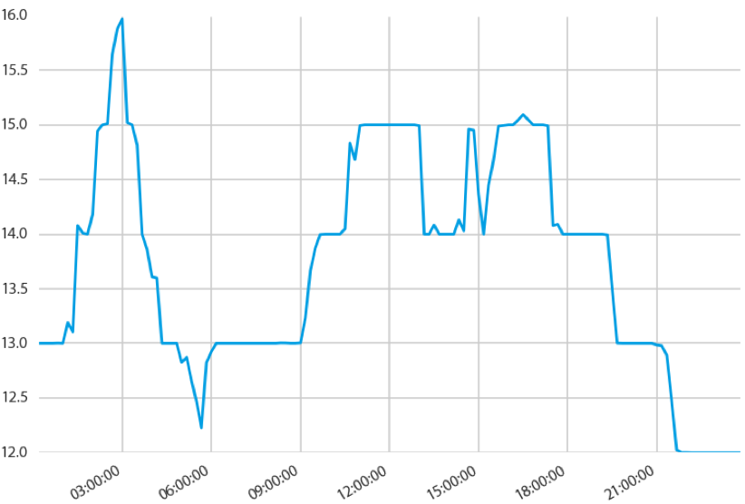

Introduction
============

Why do you need such a module?
------------------------------

tsfresh is used to to extract characteristics from time series. Let's assume you recorded the ambient temperature around
your computer over one day as the following time series:

(and yes, it is pretty cold!)

Now you want to calculate different characteristics such as the maximal or minimal temperature, the average temperature
or the number of temporary temperature peaks:

.. image:: ../images/introduction_ts_exa_features.png
   :scale: 70 %
   :alt: some characteristics of the time series
   :align: center

Without tsfresh, you would have to calculate all those characteristics by hand. With tsfresh this process is automated
and all those features can be calculated automatically.

Further tsfresh is compatible with pythons :mod:`pandas` and :mod:`scikit-learn` APIs, two important packages for Data
Science endeavours in python.

What to do with these features?
-------------------------------

The extracted features can be used to describe or cluster time series based on the extracted characteristics.
Further, they can be used to build models that perform classification/regression tasks on the time series.
Often the features give new insights into time series and their dynamics.

The tsfresh package has been used successfully in projects involving

    * the prediction of the life span of machines
    * the prediction of the quality of steel billets during a continuous casting process [1]_

What not to do with tsfresh?
----------------------------

Currently, tsfresh is not suitable

    * for usage with streaming data (The streaming data mentioned here is usually used for online operations, while time series data is usually used for offline operations. Online operation and offline operation are a pair of relative concepts.)
    * to train models on the features (we do not want to reinvent the wheel, check out the python package
      `scikit-learn <http://scikit-learn.org/stable/>`_ for example)
    * for usage with highly irregular time series (for many features). Timestamps are used only to order observations. Many features are interval-agnostic (e.g., number of peaks) and can be used with any series. But some features (e.g., linear trend) assume equal spacing in time, and should be used with care when this assumption is not appropriate.

However, some of these use cases could be implemented, if you have an application in mind, open
an issue at `<https://github.com/blue-yonder/tsfresh/issues>`_, or feel free to contact us.

What else is out there?
-----------------------

There is a matlab package called `hctsa <https://github.com/benfulcher/hctsa>`_ which can be used to automatically
extract features from time series.
It is also possible to use hctsa from within python by means of the `pyopy <https://github.com/strawlab/pyopy>`_
package.
There also exist `featuretools <https://www.featuretools.com/>`_, `FATS <http://isadoranun.github.io/tsfeat/>`_ and `cesium <http://cesium-ml.org/>`_.

References
----------

   .. [1] Christ, M., Kempa-Liehr, A.W. and Feindt, M. (2016).
         Distributed and parallel time series feature extraction for industrial big data applications.
         ArXiv e-prints: 1610.07717 URL: http://adsabs.harvard.edu/abs/2016arXiv161007717C
