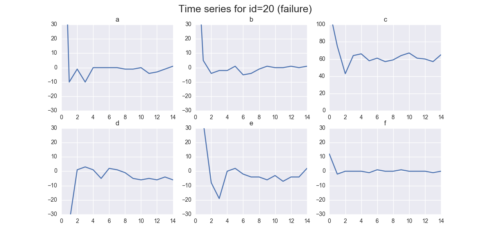

.. _quick-start-label:

Quick Start
===========

Install tsfresh
---------------

As the compiled tsfresh package is hosted on the Python Package Index (PyPI) you can easily install it with pip

.. code:: shell

   pip install tsfresh

Dive in
-------

Before boring yourself by reading the docs in detail, you can dive right into tsfresh with the following example:

We are given a data set containing robot failures as discussed in [1]_.
Each robot records time series from six different sensors.
For each sample denoted by a different id we are going to classify if the robot reports a failure or not.
From a machine learning point of view, our goal is to classify each group of time series.

To start, we load the data into python

.. code:: python

    from tsfresh.examples.robot_execution_failures import download_robot_execution_failures, \
        load_robot_execution_failures
    download_robot_execution_failures()
    timeseries, y = load_robot_execution_failures()

and end up with a pandas.DataFrame `timeseries` having the following shape

.. code:: python

   print(timeseries.head())

+-----+-----+-----+-----+-----+-----+-----+-----+-----+
|     | id  | time| F_x | F_y | F_z | T_x | T_y | T_z |
+=====+=====+=====+=====+=====+=====+=====+=====+=====+
| 0   | 1   | 0   | -1  | -1  | 63  | -3  | -1  | 0   |
+-----+-----+-----+-----+-----+-----+-----+-----+-----+
| 1   | 1   | 1   | 0   | 0   | 62  | -3  | -1  | 0   |
+-----+-----+-----+-----+-----+-----+-----+-----+-----+
| 2   | 1   | 2   | -1  | -1  | 61  | -3  | 0   | 0   |
+-----+-----+-----+-----+-----+-----+-----+-----+-----+
| 3   | 1   | 3   | -1  | -1  | 63  | -2  | -1  | 0   |
+-----+-----+-----+-----+-----+-----+-----+-----+-----+
| 4   | 1   | 4   | -1  | -1  | 63  | -3  | -1  | 0   |
+-----+-----+-----+-----+-----+-----+-----+-----+-----+
| ... | ... | ... | ... | ... | ... | ... | ... | ... |
+-----+-----+-----+-----+-----+-----+-----+-----+-----+

The first column is the DataFrame index and has no meaning here.
There are six different time series (`F_x`, `F_y`, `F_z`, `T_x`, `T_y`, `T_z`) for the different sensors. The different robots are denoted by the ids column.

On the other hand, ``y`` contains the information which robot `id` reported a failure and which not:

+---+---+
| 1 | 0 |
+---+---+
| 2 | 0 |
+---+---+
| 3 | 0 |
+---+---+
| 4 | 0 |
+---+---+
| 5 | 0 |
+---+---+
|...|...|
+---+---+

Here, for the samples with ids 1 to 5 no failure was reported.

In the following we illustrate the time series of the sample id 3 reporting no failure:

.. code:: python

    import matplotlib.pyplot as plt
    timeseries[timeseries['id'] == 3].plot(subplots=True, sharex=True, figsize=(10,10))
    plt.show()

.. image:: ../images/ts_example_robot_failures_nofail.png
   :alt: the time series for id 3 (no failure)
   :align: center

And for id 20 reporting a failure:

.. code:: python

    timeseries[timeseries['id'] == 20].plot(subplots=True, sharex=True, figsize=(10,10))
    plt.show()

You can already see some differences by eye - but for successful machine learning we have to put these differences into
numbers.

For this, tsfresh comes into place.
It allows us to automatically extract over 1200 features from those six different time series for each robot.

For extracting all features, we do:

.. code:: python

    from tsfresh import extract_features
    extracted_features = extract_features(timeseries, column_id="id", column_sort="time")

You end up with the DataFrame `extracted_features` with more than 1200 different extracted features.
We will now first, remove all ``NaN`` values (which were created by feature calculators that can not be used on the
given data, e.g., because the statistics are too low), and then select only the relevant features:

.. code-block:: python

    from tsfresh import select_features
    from tsfresh.utilities.dataframe_functions import impute

    impute(extracted_features)
    features_filtered = select_features(extracted_features, y)

Only around 300 features were classified as relevant enough.

Further, you can even perform the extraction, imputing and filtering at the same time with the
:func:`tsfresh.extract_relevant_features` function:

.. code-block:: python

    from tsfresh import extract_relevant_features

    features_filtered_direct = extract_relevant_features(timeseries, y,
                                                         column_id='id', column_sort='time')

You can now use the features in the DataFrame `features_filtered` (which is equal to
`features_filtered_direct`) in conjunction with `y` to train your classification model.
You can find an example in the Jupyter notebook
`01 Feature Extraction and Selection.ipynb <https://github.com/blue-yonder/tsfresh/blob/main/notebooks/examples/01%20Feature%20Extraction%20and%20Selection.ipynb>`_
were we train a RandomForestClassifier using the extracted features.

References

.. [1] http://archive.ics.uci.edu/ml/datasets/Robot+Execution+Failures
